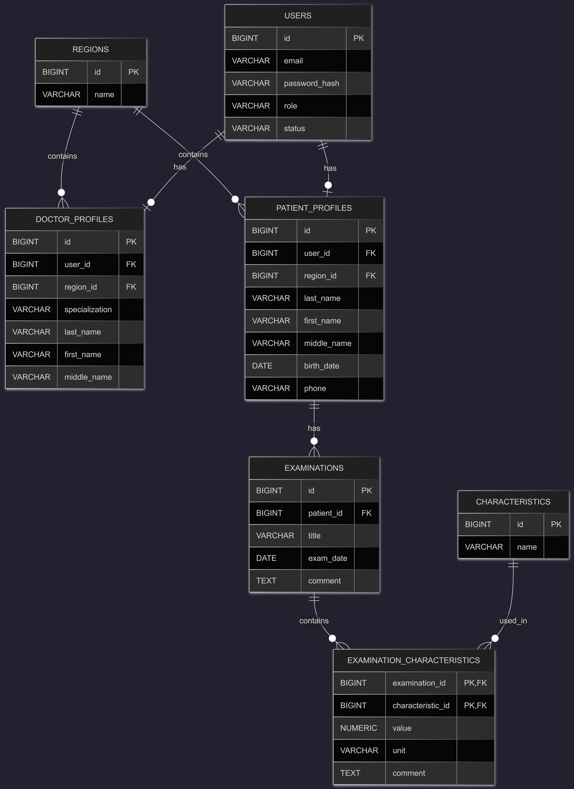

# Документация По Базе Данных

## Назначение

Система хранит учетные записи пользователей, профили врачей и пациентов, обследования и значения медицинских показателей в рамках регистра пациентов с редким заболеванием.

База данных построена на PostgreSQL и опирается на несколько ключевых принципов:

- учетные записи хранятся отдельно от профильных данных;
- доступ к данным пациента зависит от региона;
- показатели обследований хранятся в гибкой структуре, чтобы можно было добавлять новые характеристики без изменения схемы профиля пациента.

## ER-Диаграмма

## Таблицы

### `users`

Хранит данные, необходимые для аутентификации и авторизации.

Поля:

- `id` — уникальный идентификатор
- `email` — уникальный логин пользователя
- `password_hash` — хэш пароля
- `role` — роль пользователя в системе (`ADMIN`, `DOCTOR`, `PATIENT`)
- `status` — состояние учетной записи, например `ACTIVE` или `BLOCKED`

### `regions`

Хранит справочник регионов, используемый в профилях врачей и пациентов.

Поля:

- `id` — уникальный идентификатор
- `name` — уникальное название региона

### `doctor_profiles`

Хранит данные профиля врача.

Поля:

- `id` — уникальный идентификатор
- `user_id` — ссылка на учетную запись врача
- `specialization` — специальность врача
- `last_name` — фамилия
- `first_name` — имя
- `middle_name` — отчество, необязательное поле
- `region_id` — ссылка на регион

### `patient_profiles`

Хранит данные профиля пациента.

Поля:

- `id` — уникальный идентификатор
- `user_id` — ссылка на учетную запись пациента
- `last_name` — фамилия
- `first_name` — имя
- `middle_name` — отчество, необязательное поле
- `birth_date` — дата рождения
- `phone` — номер телефона
- `region_id` — ссылка на регион

### `examinations`

Хранит обследования, добавленные пациентами.

Поля:

- `id` — уникальный идентификатор
- `patient_id` — ссылка на профиль пациента
- `title` — название обследования
- `exam_date` — дата обследования
- `comment` — комментарий, необязательное поле

### `characteristics`

Хранит справочник характеристик, которые могут использоваться в обследованиях.

Поля:

- `id` — уникальный идентификатор
- `name` — уникальное название характеристики

Примеры:

- артериальное давление
- пульс
- сатурация

### `examination_characteristics`

Хранит значения показателей внутри конкретного обследования.

Поля:

- `examination_id` — ссылка на обследование
- `characteristic_id` — ссылка на характеристику
- `value` — числовое значение показателя
- `unit` — единица измерения, необязательное поле
- `comment` — комментарий, необязательное поле

В этой таблице используется составной первичный ключ:

- `examination_id`
- `characteristic_id`

Это означает, что одна и та же характеристика не может быть добавлена дважды в рамках одного обследования.

## Связи Между Таблицами

- одна запись в `users` может быть связана с одним профилем врача
- одна запись в `users` может быть связана с одним профилем пациента
- один регион может быть связан со многими профилями врачей
- один регион может быть связан со многими профилями пациентов
- один пациент может иметь много обследований
- одно обследование может содержать много значений характеристик
- одна характеристика может использоваться в разных обследованиях

## Особенности Проектирования

- Схема разделяет данные для входа в систему и профильные данные пользователей.
- Регионы вынесены в отдельный справочник, чтобы исключить расхождения в названиях.
- Обследования выделены в отдельную сущность, так как один пациент может проходить много обследований в разное время.
- Значения характеристик хранятся в отдельной связующей таблице, поскольку связь между обследованием и характеристикой содержит собственные данные: `value`, `unit` и `comment`.
